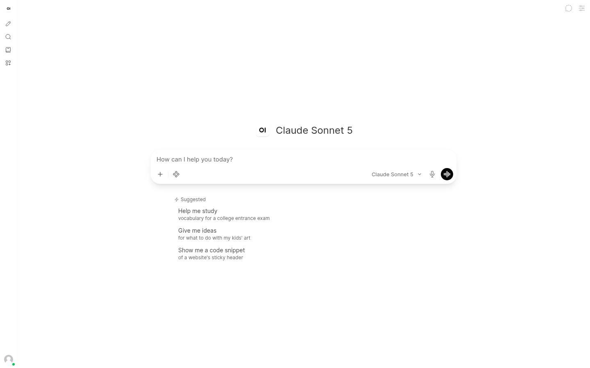
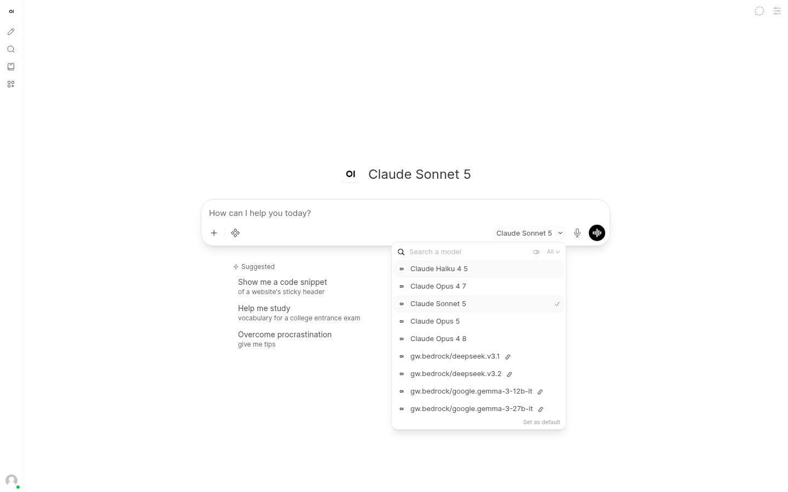

# Open WebUI on AWS with Amazon Bedrock

[](LICENSE)
[](infra/)

**Run the official Open WebUI experience on AWS, preserve the signed-in user at a shared Amazon Bedrock AgentCore inference boundary, and present Bedrock models through the API shape they actually support—without maintaining an Open WebUI fork.**

[Quick start](#deploy-for-evaluation) · [Why AgentCore](#why-agentcore-is-in-the-path) · [Architecture](#architecture-and-boundaries) · [Governance](#optional-consumption-governance) · [Costs](docs/COSTS.md) · [Full documentation](docs/README.md)

> [!IMPORTANT]
> **AWS sample for evaluation and customization.** Before using this architecture
> in production, perform your own security review and threat model, validate it
> at your expected scale, and establish backup, monitoring, patching, and
> operational ownership. [Open WebUI](https://github.com/open-webui/open-webui)
> is third-party software that AWS does not maintain or support. See the
> [production considerations](docs/AWS_DEPLOYMENT_GUIDE.md#production-considerations),
> [`DISCLAIMER.txt`](DISCLAIMER.txt), and [third-party notices](THIRD-PARTY-LICENSES.md).



<sub>Authentic capture from a non-production deployment of the separately licensed Open WebUI interface. Synthetic user; no account or customer identifiers shown.</sub>

## Introduction

Teams that want to run Open WebUI on AWS still need to integrate identity, networking, persistent application data, model access, and day-two operations. This project supplies those pieces with AWS managed services and an authenticated gateway to Amazon Bedrock while keeping the official Open WebUI image unchanged. The result is a deployable reference architecture that pairs a polished, self-hosted AI interface with an AWS control plane the platform team can inspect and operate.

### What is Open WebUI?

[Open WebUI](https://github.com/open-webui/open-webui) is a separately licensed, self-hosted AI application that gives users a familiar conversational experience for working with large language models. Instead of teaching every user a provider API, SDK, or command-line tool, Open WebUI provides the application layer: sign-in, a model picker, chat history, rich conversations, file-oriented workflows, and an extensible interface that feels like a modern AI assistant.

Open WebUI is model-provider friendly, but it is not an AWS deployment architecture by itself. A platform team still needs to decide where the application runs, how users authenticate, where conversations and files persist, how model requests are authorized, and how the environment is upgraded and operated. This sample supplies those AWS-specific pieces while leaving the official Open WebUI image unchanged.

### Why Amazon Bedrock?

[Amazon Bedrock](https://docs.aws.amazon.com/bedrock/latest/userguide/what-is-bedrock.html) provides managed access to foundation models from multiple providers through AWS APIs. Teams can evaluate and offer different model families without deploying or operating the underlying model-serving infrastructure themselves. They also retain an AWS control plane for permissions, regional deployment, monitoring, and cost management. See [APIs supported by Amazon Bedrock](https://docs.aws.amazon.com/bedrock/latest/userguide/apis.html) and [supported foundation models](https://docs.aws.amazon.com/bedrock/latest/userguide/models-supported.html).

A multi-model service introduces an integration challenge, however: not every model accepts the same request format. Some models use OpenAI-style Chat Completions, others require the Responses API, and Anthropic Claude uses the Messages API. Simply placing every model in one undifferentiated menu produces a poor experience—users can select models that the active connection cannot call. This sample solves that mismatch with three API-compatible lanes and a capability-aware catalog.

### What does Amazon Bedrock AgentCore add?

[Amazon Bedrock AgentCore](https://docs.aws.amazon.com/bedrock-agentcore/latest/devguide/what-is-bedrock-agentcore.html) sits between Open WebUI and model inference as a shared, authenticated gateway. In this project, users sign in through Amazon Cognito, Open WebUI forwards each user's OAuth access token, and the AgentCore gateway validates that JWT before accepting the model request. The downstream Bedrock-compatible call is made with the gateway's IAM role, so Open WebUI does not need to store a static model API key.

That [AgentCore Gateway](https://docs.aws.amazon.com/bedrock-agentcore/latest/devguide/gateway.html) boundary gives the platform team a consistent point for authentication and request interception. For the two native lanes, a **REQUEST interceptor**—a Lambda function AgentCore invokes before forwarding the HTTP request—returns capability-filtered Chat Completions and Responses model lists. The Claude pipe discovers available Claude models separately with the Fargate task role because discovery has no user context; Claude inference still traverses AgentCore with the signed-in user's token. When optional governance is enabled, the same interceptor can also check recorded per-user consumption, reserve estimated usage, shape requests, and attach team-attribution headers before the managed target receives the call.

### What the combination delivers

For a user, the experience is deliberately simple: open one web application, sign in with Cognito, choose a compatible Bedrock model, and start a conversation. AWS credentials, model-specific endpoints, and API-shape differences remain behind the interface.

For a platform team, the project is an inspectable starting point rather than a black-box product. It deploys the application and supporting data services in the team's AWS account, establishes Cognito-backed sign-in and AgentCore JWT validation, preserves the official upstream image, and provides one orchestrated path for deployment and upgrades. Optional governance can be enabled when per-user visibility, admission, attribution, pricing coverage, and an operator console are useful.

The sample is intended to be adapted: review and harden the architecture for your production requirements, own the separately licensed Open WebUI application, validate model availability in each target account and region, and decide whether the optional availability-first governance behavior matches your operating model. With that ownership in place, it demonstrates how AWS managed services can turn an Open WebUI container into a persistent, user-aware, multi-model AI platform built around Amazon Bedrock.

## Why run Open WebUI this way?

| Benefit | What this sample adds |
|---|---|
| **Keep the upstream experience** | ECS runs an official, unmodified Open WebUI release normally resolved to an immutable image digest. There is no local Open WebUI source fork, patch set, Dockerfile, or application-image pipeline to maintain. |
| **Put a user-aware boundary in front of models** | Cognito authenticates the person. AgentCore validates that user's JWT at one shared inference endpoint before its gateway role invokes Bedrock—without a static model API key in Open WebUI. |
| **Make a mixed model catalog usable** | Chat Completions, Responses, and Anthropic Messages are separate compatibility lanes, so models appear through the protocol they support instead of one error-prone undifferentiated list. |
| **Own the AWS deployment** | CDK provisions private application/data infrastructure, scalable Fargate compute, Cognito sign-in, persistent PostgreSQL/pgvector and Redis state, uploads, secrets, and CloudFront delivery. |
| **Add governance only when it helps** | An optional, off-by-default module adds per-user usage visibility, USD/RPM admission controls, team attribution headers, pricing coverage, alarms, and a Cloudscape console. |

**Deployment profile:** `us-east-1` is the documented default for the full three-lane experience · AWS CLI v2, Node.js 20+, npm, and Python 3 + pip are required · Docker is not required · The base deployment creates five CDK stacks · AWS charges apply

## Why AgentCore is in the path

```text
Signed-in user → Open WebUI → AgentCore inference gateway → Amazon Bedrock
                        JWT validated here      gateway IAM role downstream
```

AgentCore provides a deliberate control point between the third-party UI and model providers:

1. **One authenticated endpoint.** Open WebUI sends the user's Cognito access token rather than storing a model API key.
2. **User context at the boundary.** The gateway can identify the caller before forwarding the request, which is where this sample adds compatibility filtering and—when enabled—admission and attribution logic.
3. **One implemented interception point.** The global REQUEST interceptor can filter discovery and, when metering is enabled, perform admission, request shaping, and attribution before the managed target receives the call.

> [!NOTE]
> The Cognito identity terminates at AgentCore. Amazon Bedrock is invoked by the
> gateway's IAM role, not by a per-user AWS principal. This sample has not
> verified AgentCore Policy or Bedrock Guardrails enforcement on inference
> connector traffic. See the
> [gateway integration guide](docs/GATEWAY_INTEGRATION_GUIDE.md) for the exact
> trust boundary, request paths, permissions, and non-claims.

## One Open WebUI experience, three compatible lanes

| Lane | Why it exists | User-visible result |
|---|---|---|
| **Chat Completions** | Native OpenAI chat request shape | Compatible chat models are listed under the seeded `gw` connection. |
| **Responses** | Models that require the newer Responses API | Responses-capable choices use a dedicated `gwr` connection rather than being mixed into Chat Completions. |
| **Anthropic Messages** | Claude-specific Messages semantics | A manifold pipe translates supported OpenAI-shaped input/output while Claude inference still traverses AgentCore with the user's token. |



<sub>Real model picker from the sample deployment. Availability is account- and region-specific. The probed snapshot narrows protocol mismatches but is not a permanent invocation guarantee.</sub>

## Deploy for evaluation

The supported path is one orchestrated script—not bare CDK:

```bash
git clone https://github.com/aws-samples/sample-open-webui-on-aws-with-bedrock.git
cd sample-open-webui-on-aws-with-bedrock
cp .env.example .env
./deploy.sh
```

The script selects the AWS profile/region, bootstraps CDK when needed, resolves the Open WebUI release, deploys the stacks, reconciles Cognito callbacks and secrets, updates the ECS task, and prints the application URL.

For a non-interactive test deployment:

```bash
./deploy.sh --profile YOUR_PROFILE --region us-east-1 --yes
```

After deployment, create/register a test Cognito user, add the initial operator to `admin`, sign in, and validate one non-sensitive request in each non-empty lane. Follow the [deployment guide](docs/AWS_DEPLOYMENT_GUIDE.md) for prerequisites, model probing, custom domains, validation, troubleshooting, retained data, and account/region-bound cleanup.

## Stay upstream—do not own a fork

```text
Official Open WebUI release → immutable digest → ECS task on Fargate
                                      +
                    AWS-authored runtime configuration
```

The deployment starts the official image's own `start.sh`. Small AWS-authored seeders install two native gateway connections and the Claude pipe into the application database at runtime. Operators can leave `OPEN_WEBUI_IMAGE` unset to resolve the latest official release on each full deployment, or pin a tested release/digest for controlled upgrades and rollback.

This separation is operationally useful, but it does not transfer ownership: Open WebUI remains separately licensed and supported upstream. Read the [upgrade runbook](docs/UPGRADE_RUNBOOK.md) before changing versions.

## Optional consumption governance

Enable the module explicitly:

```bash
./deploy.sh --metering
```

It is designed to answer three operator questions:

1. **What did each Cognito user consume?** Persisted provider usage settles into an append-only ledger and monthly counters.
2. **Should the next request be admitted?** The gateway interceptor checks per-user recorded USD and RPM policy before inference and can return an OpenAI-shaped 429.
3. **How is consumption priced and monitored?** A regional AWS Price List catalog, operator overrides, coverage status, alarms, and reconciliation signals support operational review.

The console provides admin governance views and an ordinary user's self-service usage view. Team attribution uses Bedrock Project/workspace headers when billing tags are activated.

> [!NOTE]
> The optional module is designed for operational consumption governance, not
> authoritative billing. Before production use, review its next-request
> enforcement, capture, pricing, and reconciliation behavior in the
> [metering contract](docs/METERING.md) and tune policies for your workload.

## Architecture and boundaries

The product screenshots above show what users receive. This canonical diagram shows the detailed trust, network, data, and optional-governance topology:


Key boundaries:

- CloudFront is the public HTTPS entry point; its VPC-origin and ALB-to-task hops are HTTP inside the VPC.
- Fargate, Aurora, and Redis run privately, while registry and managed-service egress still exists.
- The checked-in model capability matrix is a dated account/region snapshot; scheduled refresh is optional and off by default.
- Some stateful resources are retained during stack removal and can continue billing.
- Model use, database capacity, NAT, logs, transfer, and optional governance are workload-dependent costs. Use the [cost-planning guide](docs/COSTS.md).

## Choose your next step

| Goal | Read |
|---|---|
| Evaluate AgentCore identity and model routing | [Gateway integration guide](docs/GATEWAY_INTEGRATION_GUIDE.md) |
| Deploy, validate, operate, or remove the sample | [AWS deployment guide](docs/AWS_DEPLOYMENT_GUIDE.md) |
| Evaluate consumption governance | [Metering contract and operator guide](docs/METERING.md) |
| Build a workload-specific estimate | [Cost planning](docs/COSTS.md) |
| Pin, upgrade, or roll back Open WebUI | [Upgrade runbook](docs/UPGRADE_RUNBOOK.md) |
| Maintain or contribute to the implementation | [Documentation home](docs/README.md) · [Contributing](CONTRIBUTING.md) · [Security](SECURITY.md) |

This sample is licensed under [MIT-0](LICENSE). Open WebUI and dependency trees retain their own licenses and notices; see [`NOTICE`](NOTICE) and [`THIRD-PARTY-LICENSES.md`](THIRD-PARTY-LICENSES.md).
